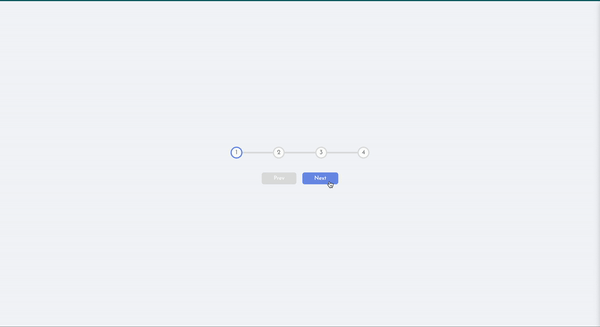
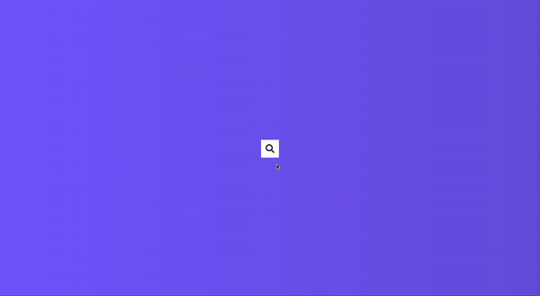
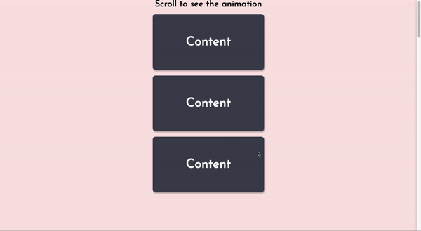
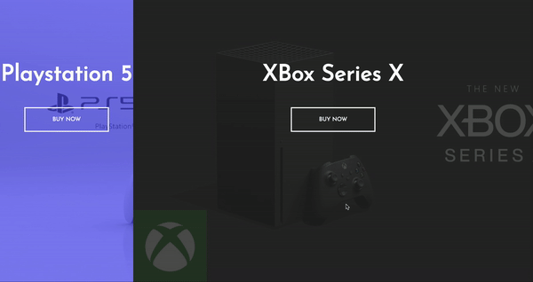
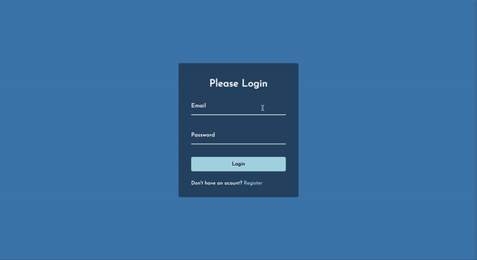

# 50_Projects_in_50_days
Projects from the 50 Projects in 50 days course taken through Udemy

### Project 1: Expanding Cards

- used Javascript, CSS, and HTML
- cards will display small on the screen with a background image when not clicked
- cards will expand and a heading will appear with a css transition when clicked on

### Project 2: Progress Steps

- used Javascript, CSS, and HTML
- clicking the next button transitions the circles to the next number
- when we get to the last one the next button becomes disabled
- when we get to the first one the previous button becomes disabled

### Project 3: Rotating Navigation

- used Javascript, CSS, and HTML
- once you click on the navigation icon, the page rotates and the navigation appears at the bottom of the page
- the icon also changes to a close button once the navigation appears

### Project 4: Hidden Search Widget

- used Javascript, CSS, and HTML
- when you toggle the search icon the search field expands and collapses

### Project 5: Blurry Loading Page

- used Javascript, CSS, and HTML
- when you reload the page, the image blurs completely then the image unblurs 
- the loading text appears opaque and becomes transparent as the page reloads 

### Project 6: Scrolling Animation

- used Javascript, CSS, and HTML
- when you scroll down the cards come in from the left and right
- when you scroll back up the class for the cards gets removed and the cards animate off the screen

### Project 7: Split Landing Page

- used Javascript, CSS, and HTML
- when you hover over one side the content expands to 75% of the screen
- when you hover on the other side the content collapses and the new side expands

### Project 8: Form Wave Animation

- used Javascript, CSS, and HTML
- when you click on the label of the form the label moves up with a wave effect
- when you click away the label moves back down with the wave effect

### Project 9: Sound Board

- used Javascript, CSS, and HTML
- user can click on each one of the buttons and a different sound will play based on the description

